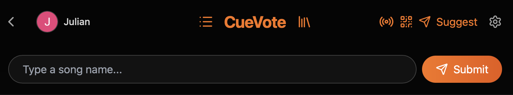

# CueVote - The Interactive Jukebox

  

  <strong>🌐 Visit the live platform: <a href="https://cuevote.com">CueVote.com</a></strong>

---

**CueVote** is a modern, community-driven social jukebox built for the YouTube era. It democratizes music selection by allowing everyone in the room to suggest videos and vote on the queue in real-time.

Whether you're hosting a house party, running a bar, or just hanging out online, CueVote ensures the best videos play next — decided by the crowd, not an algorithm.

---

## 🚀 Core Features

### 🎧 Social Jukebox
* **Democratic Queue:** Users vote videos up (Like) or down (Dislike). The highest-rated videos jump to the top.
* **Collaborative Suggestions:** Anyone can search and add videos from YouTube.
* **Real-Time Sync:** Queue updates, votes, and playback state sync instantly across all devices.

### 🏛️ Lobby & Discovery
* **Public & Private Channels:** Create open rooms for everyone or password-protected private rooms for friends.
* **Search & Filters:** Easily find active parties or filter by your own created channels.
* **Personalized Experience:** Sign in with Google to track your history, favorite videos, and managed channels.

### 🧠 Smart Queue System
* **Vote-Based Sorting:** The queue dynamically reorders itself based on live votes.
* **Auto-Refill (Auto-DJ):** When the queue runs dry, the system intelligently picks videos from the room's history to keep the vibe going.
* **Smart Replacement:** If the queue is full, new high-quality suggestions can replace the lowest-voted track automatically (optional).
* **Duplicate Prevention:** Intelligent checks prevent the same video (or title) from being played too frequently.

### 📺 Playback Modes
* **Host Mode (Venue/TV):** The "Main Screen" experience. Connect a laptop, TV, or projector to play the music and video.
    * *Cinema Mode:* Full-screen immersive experience.
    * *Venue Mode:* Specialized view for TVs that shows the playlist/QR code instead of just the video.
* **Guest Mode:** Users join on their phones to view the queue, vote, and suggest without interrupting playback.
* **Prelisten:** Guests can privately preview a video on their own device before voting it up.

### 🛡️ Moderation & Controls
* **Owner Powers:**
    * **Skip/Pause/Seek:** Full playback control.
    * **Force Play:** Jump a specific video to "Now Playing" immediately.
    * **Banning:** Ban specific videos from the session.
    * **Manual Approval:** Switch to "Manual Mode" to review every suggestion before it hits the queue.
* **System Integrity:**
    * **Spam Protection:** Rate limits and duplicate cooldowns.
    * **Content Filters:** Option to restrict to "Music Only" categories or limit video duration.

### 📚 Channel Library
* **Track History:** The channel automatically remembers videos played in the past.
* **Quick Add:** Easily re-add previously played videos to the queue without searching.

### ⚖️ Legal & Privacy
* **GDPR Compliant:** Users have full control to request account deletion and data removal directly within the app.
* **Transparency:** Dedicated Legal Center with Terms of Service, Privacy Policy, and Colophon.
* **YouTube Compliance:** Uses the official YouTube iFrame API to ensure creators get views and ad revenue (if applicable).

---

## 🛠️ Technical Stack

* **Frontend:** React, Tailwind CSS, Lucide Icons.
* **Backend:** Node.js, WebSocket (`ws`), SQLite3.
* **Database:** SQLite with WAL mode for high-performance, concurrent read/write operations.
* **API:** YouTube Data API v3 for robust video metadata verification.

---

## 📦 Deployment (Brief)

CueVote is ready to use at **[CueVote.com](https://cuevote.com)**. For developers who wish to host their own instance:

1.  **Clone the repo**
2.  **Install dependencies:** `npm install` (root), `cd cuevote-server && npm install`, `cd cuevote-client && npm install`
3.  **Configure `.env`:** Add your `YOUTUBE_API_KEY` and `GOOGLE_CLIENT_ID`.
4.  **Build & Run:** `npm run build` and `npm start`.

*See `DEPLOYMENT.md` for full instructions.*

---

## 📜 License & Credits

Copyright © 2026 **Julian Zienert** — jzienert@student.codam.nl

The source code of this project is licensed under the **[PolyForm Noncommercial License 1.0.0](LICENSE)**.

You are free to read, modify, and self-host for personal use. Commercial use of this code is prohibited.
For direct use, visit [cuevote.com](https://cuevote.com).

---

*Where community meets rhythm — every vote changes the beat.*
